#  KeePassXC — Material

> **Installer transition:** this fork now targets unsigned Squirrel.Windows packages as its sole
> supported installation and update format. The generated executables are intentionally unsigned
> and may display Unknown Publisher or SmartScreen warnings.

Run `build.bat` for the native application, `build-installer.bat` for verified `Setup.exe`,
`RELEASES`, and full-package output, or `download-dependencies.bat` to prepare the pinned user-scoped
toolchain. Each accepts `/s` or `--silent`.

A **Windows-only** fork of [KeePassXC](https://keepassxc.org) whose interface is being rebuilt in
**Material Design 3**.

The cryptography, the KDBX format handling, the browser and SSH integrations and the command line
tool are upstream KeePassXC and are deliberately untouched. What changed is what you look at: the
stock Qt styling — `BaseStyle` (4 860 lines), `LightStyle`, `DarkStyle`, `phantomcolor` and all
four `.qss` sheets — has been deleted and replaced by one token-driven design system.

> This is a personal fork and it is unfinished — see [Status](#status) before you rely on it. For
> the official, supported password manager, use
> [keepassxreboot/keepassxc](https://github.com/keepassxreboot/keepassxc).

## Windows only

Linux support has been removed from this fork, not merely disabled. Gone from the tree: the
freedesktop.org Secret Service server, the XDG desktop portals, D-Bus, the X11 and Wayland
auto-type backends, PolKit quick unlock, `nixutils`, and Snap / Flatpak / AppImage packaging. The
CI builds and tests Windows only. macOS sources are still present but are neither built nor tested
here.

If you need Linux or macOS, use upstream.

## The interface

The window is a Material 3 shell: an 88 px navigation rail, a 64 px top app bar, a database tab
strip, and a five-destination stack. `Ctrl+Shift+F` opens a command palette listing all 218
`QAction`s with their menu path and shortcut.

| Destination | State |
| --- | --- |
| **Vault** | **Still the stock three-pane widget.** Restyled by the Material stylesheet, but the group tree / entry table / preview layout is upstream's. The Material vault screen is written and not yet wired — see [Status](#status). |
| **Reports** | Material screen — password health, breach and reuse findings, database statistics as stat cards |
| **History** | Material screen — local Git-backed revision history, with diff and restore |
| **Changelog** | Material screen — every released version, searchable and date-filterable, exportable to Markdown |
| **Settings** | Material screen — appearance, language, behaviour and integrations, plus spec sheets for individual settings |

### Appearance is a runtime setting, not a build flag

Everything the interface draws resolves through one design system, so the whole application
restyles live:

- **Theme** — light or dark, or follow Windows.
- **Seed colour** — KeePassXC blue, baseline purple, vault green or signal amber. The seed drives
  the primary and container roles; surfaces, outlines and status colours flip with the light/dark
  family.
- **Density** — compact, comfortable or spacious, changing every list, tree and table row height
  (40 / 52 / 64 px).
- **Interface font** — family, size scale and weight, with a CJK-safe fallback.

No widget in `src/` hard-codes a colour. They ask the theme for a semantic role, so a seed or
density change repaints the application without a restart.

### Cross-cutting behaviour

- **Regex builder** — a guided builder (character classes, anchors, quantifiers, groups, flags,
  sample text, live matches and captures) reachable from *every* search bar. Plain-text search
  stays the default; regex is an explicit opt-in, and query, pattern, flags and mode stay in sync
  both ways.
- **Non-blocking notifications** — informational, success and progress messages are snackbars
  anchored bottom-centre, never modal dialogs. Modals are reserved for decisions you must make:
  confirmations, destructive gates and credential steps. Dismissed notifications stay reviewable in
  the notification centre.
- **Language modes** — English, playful Hong Kong Cantonese, or bilingual, with an independent 1–5
  humour slider per language. The humour styles the *voice* only: what happened, what is affected
  and what is irreversible stay exact at every level.
- **Passkey clipboard transfer** — passkeys can be copied and pasted as
  `keepassxc-passkey:v1:<base64>`. Copying a private key raises a warning that cannot be suppressed
  and defaults to Cancel, because base64 is encoding, not encryption: anything you paste that
  string into can read the key.

### Accessibility

Keyboard reachability, visible focus, correct roles and names, contrast and reduced-motion respect
are treated as defects when broken, not as polish. So is visual clipping and mis-sizing at
100/125/150/200 % display scale and in the longest localized strings.

## Password manager features

Inherited from upstream KeePassXC and intact:

- Create, open and save KDBX 3 and KDBX 4 databases; everything is encrypted at rest
- Entries organised into groups, with tags, attachments, custom attributes and field references
- Password and passphrase generator
- TOTP storage and generation
- YubiKey / OnlyKey challenge-response
- Auto-Type into any application
- Browser integration for Chrome, Firefox, Edge, Chromium, Vivaldi, Brave and Tor Browser,
  including passkeys — extensions register themselves per-user on first run
- Windows Hello quick unlock
- Import from CSV, 1Password, Bitwarden, Proton Pass and KeePass1
- Export to CSV, XML and HTML
- SSH Agent integration
- Command line interface (`keepassxc-cli`)
- Additional ciphers: Twofish and ChaCha20

Removed with Linux: freedesktop.org Secret Service.

See [CHANGELOG.md](CHANGELOG.md) for release history and
[docs/topics/KeyboardShortcuts.adoc](./docs/topics/KeyboardShortcuts.adoc) for shortcuts.

## Building

Requires **Visual Studio 2022+** with the C++ workload, **Qt 6.8 msvc2022_64**, **CMake 3.16+** and
**Ninja**. Native dependencies (Botan 3, minizip, libqrencode, zlib, readline) are declared in
[`vcpkg.json`](vcpkg.json) and resolved by vcpkg.

From an **x64 Native Tools Command Prompt**:

```bash
cmake -B build -G Ninja -DCMAKE_BUILD_TYPE=Debug -DCMAKE_PREFIX_PATH=C:/Qt/6.8.3/msvc2022_64 -DCMAKE_TOOLCHAIN_FILE=%VCPKG_ROOT%/scripts/buildsystems/vcpkg.cmake
```

```bash
cmake --build build
```

Longer instructions, including the test invocations, live in [INSTALL.md](./INSTALL.md).

### Screenshots come out black — this is not a bug in the app

KeePassXC calls `SetWindowDisplayAffinity(WDA_EXCLUDEFROMCAPTURE)` on its top-level windows. The
window is plainly visible on your monitor and fully hit-testable, but `PrintWindow`, `BitBlt` and
`CopyFromScreen` all return black, and a desktop grab of its rectangle returns *the windows behind
it*. Pass `--allow-screencapture` when you need to record or screenshot it. This is upstream
behaviour and it cost this project several hours of misdiagnosis.

## Layout of the UI code

```
src/gui/material/
  MaterialTheme.*        colour roles, seeds, density, type scale, palette
  MaterialStyleSheet.*   the single generated stylesheet for stock Qt widgets
  MaterialStyle.*        QProxyStyle for what a stylesheet cannot express
  MaterialIcons.*        Material Symbols names resolved to bundled SVGs
  MaterialShell.*        the window interior: rail, app bar, tab strip, stack
  Material<Component>.*  buttons, chips, switches, cards, search bars,
                         snackbars, overlays, item delegates, screens and
                         spec sheets
```

Adding a surface means composing these components and asking the theme for roles — not writing
another stylesheet.

## Status

Honest state of the rewrite, measured rather than remembered:

- **Design parity is proven, not assumed.** Every one of the nine checked-in design references
  under `design/` has a real capture of the reference and of the built application at the identical
  tuple, a labelled side-by-side comparison, a machine-readable diff and a hand-written Material
  Design 3 audit (`design/parity/`). Mismatch runs from 4.8 % (entry sheet) to 20.4 % (regex
  builder). Repaired this pass: the window now draws its own Material title bar in place of the OS
  caption, the regex builder is the design's workbench, the Reports cards carry the reference
  anatomy and the vault root lists every entry. The audits list what is still open: the app bar
  content, vault health chips and group filter, and smaller differences on Settings, Appearance,
  History and Changelog.
- **The feature inventory is fail-closed and currently red.** `docs/features/inventory.json` names
  86 canonical features on two surfaces; `node scripts/check-feature-inventory.mjs` reports how many
  rows are fully green (implementation, copy, article, test, interaction record and capture all
  resolving). At the last measurement that number was **0 of 172**, which is the work list.
- **Done since the previous status** — the legacy status bar under the shell is gone; the welcome
  screen shows the running version, revision and the exact updated-at time of that revision; the
  dim sum surprise is a ten percent draw with no opt-out; the command palette is on `Ctrl+Shift+F`;
  `build.bat` exports its own MSVC environment; releases carry a CI-measured line count, workflow
  timing and a dim sum code name with the public photo attached.
- **Not done** — everything the inventory marks `missing`: School mode, narrator, scheduled
  settings, per-element appearance editors and toy locks, tab groups and docking, the authenticator,
  bulk actions and exports, offline docs, ADHD modes, the file converter and Ollama manager, the
  documentation site, and the rest of the list.

[HANDOFF.md](./HANDOFF.md) carries the full picture and the next owner's route.

## Captures

Every image below is a capture of the built application, taken by handle on an off-screen desktop through `design/parity/capture.mjs` at the commit named beside it, in light theme and bilingual mode with the key-file fixture database. The reference and the pixel diff for each one sit beside it under `design/parity/evidence/<row>/`.

<details>
<summary>Built captures of every destination (9 images)</summary>

**The shell: rail, app bar, tab strip and the vault destination (1440×920)** — commit `cd7d2de63404`

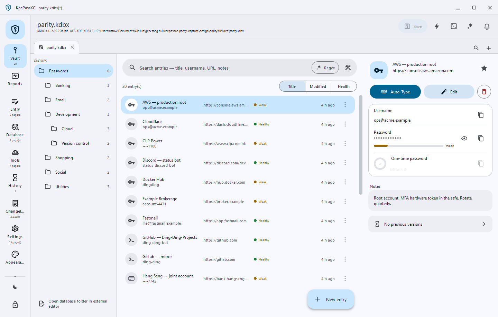

**Vault destination (1440×860)** — commit `cd7d2de63404`

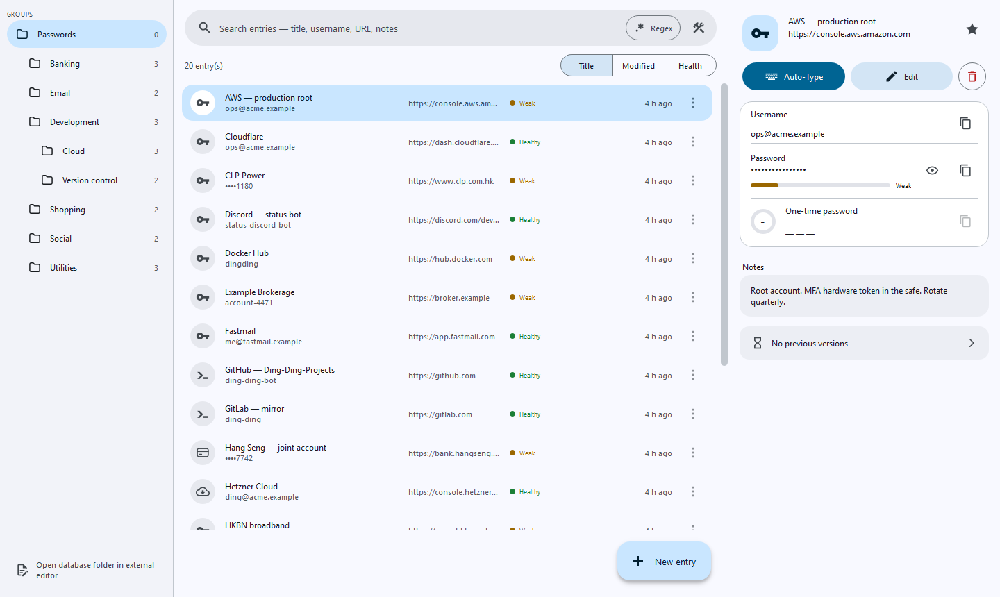

**Reports destination (1200×860)** — commit `cd7d2de63404`

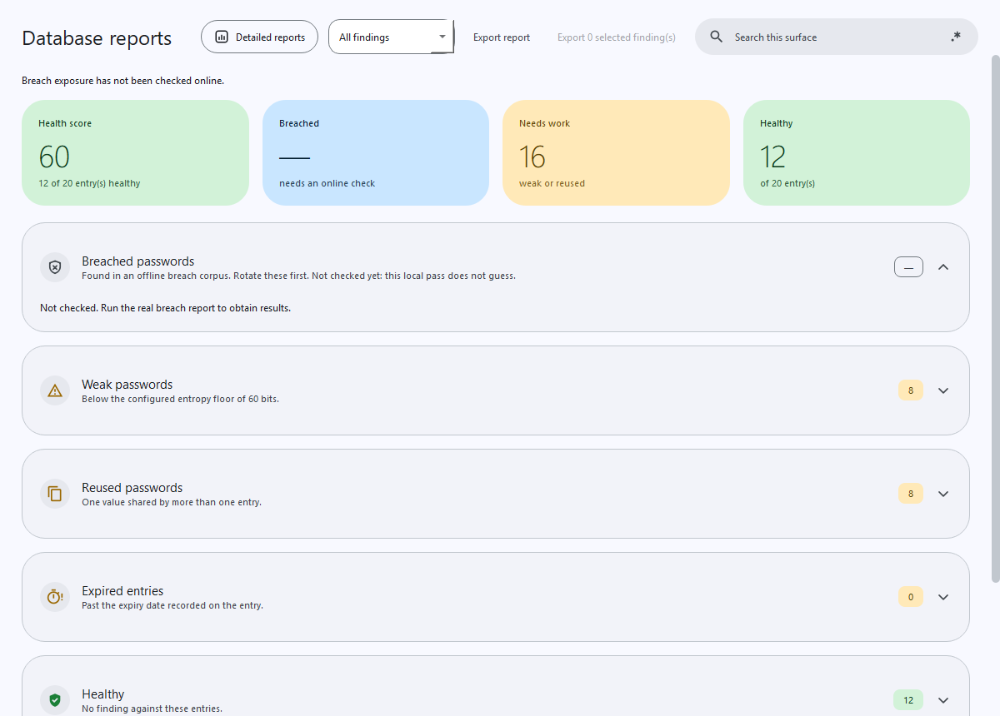

**History destination (1200×860)** — commit `cd7d2de63404`

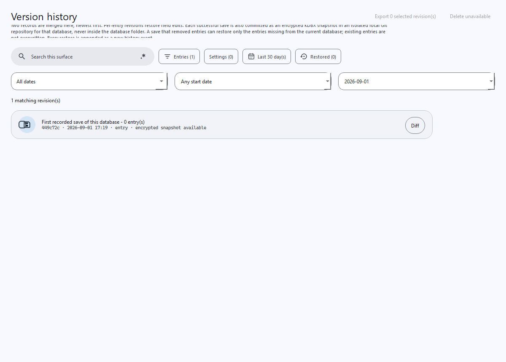

**Changelog destination (1200×860)** — commit `cd7d2de63404`

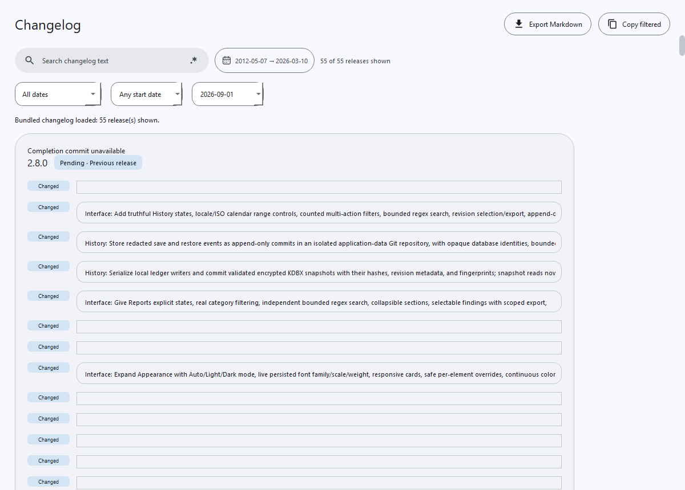

**Settings destination, General page (1280×860)** — commit `cd7d2de63404`

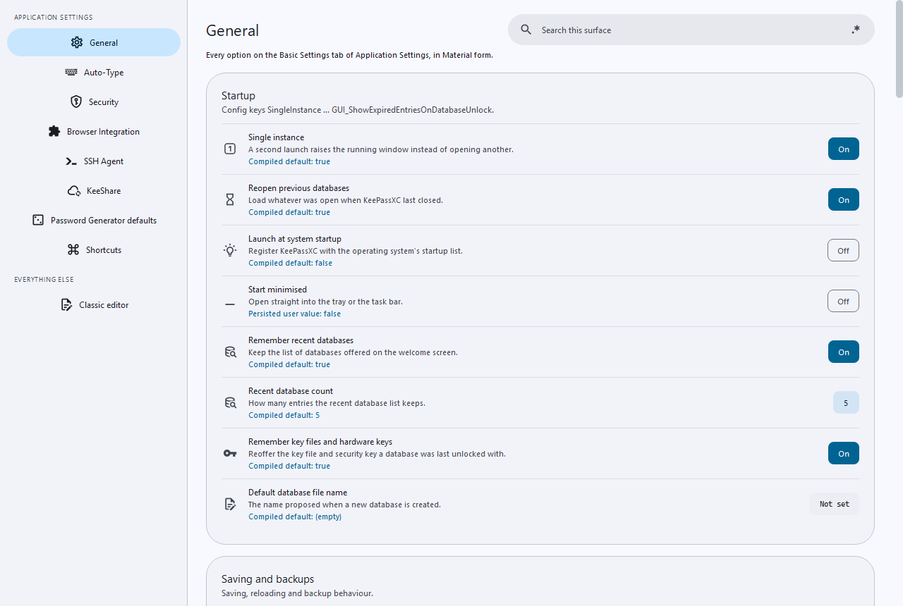

**Appearance destination (1200×860)** — commit `cd7d2de63404`

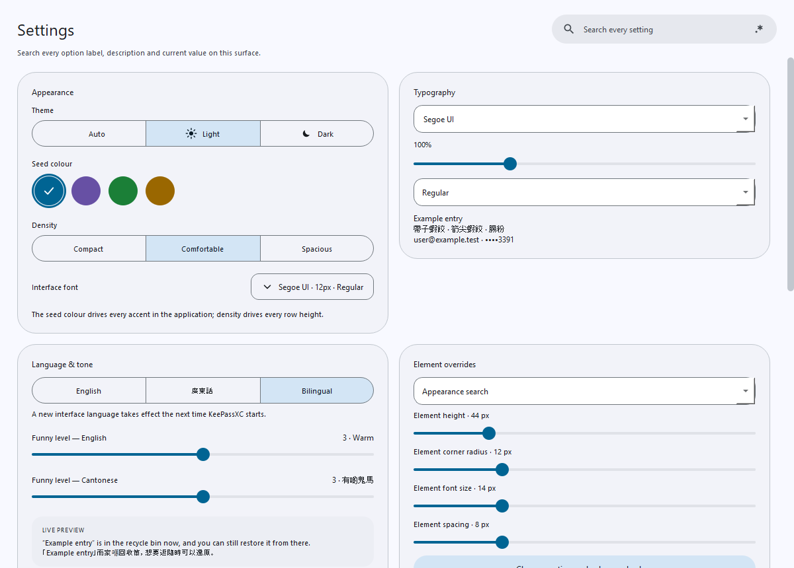

**Entry sheet (1280×860)** — commit `cd7d2de63404`

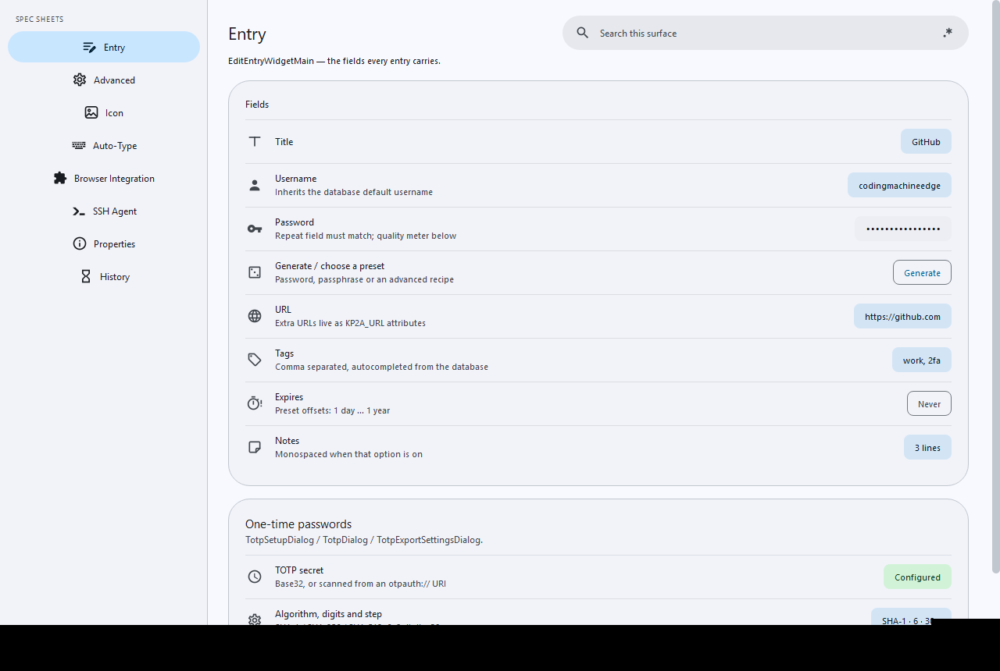

**Regex builder overlay over the vault (1040×720)** — commit `cd7d2de63404`

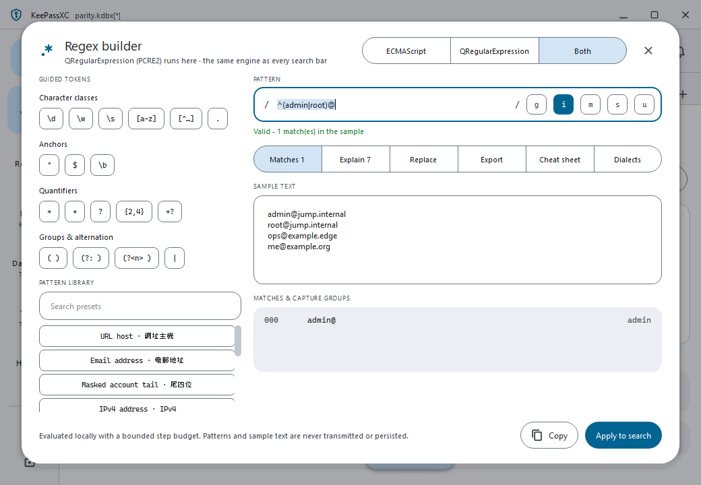

</details>

<details>
<summary>Reference versus built comparisons (9 images)</summary>

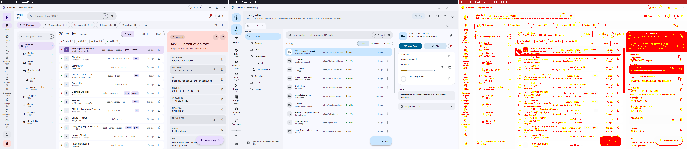

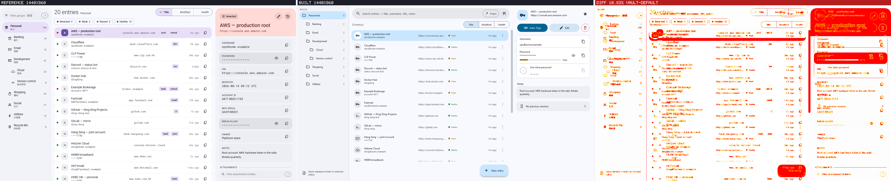

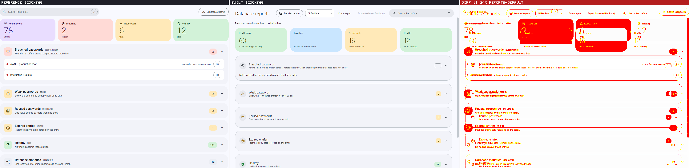

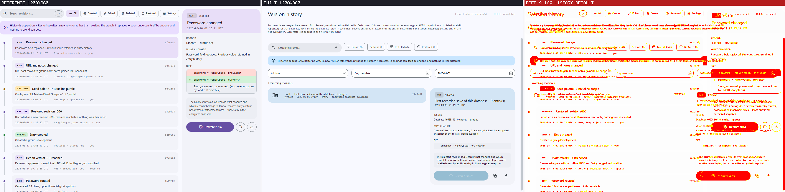

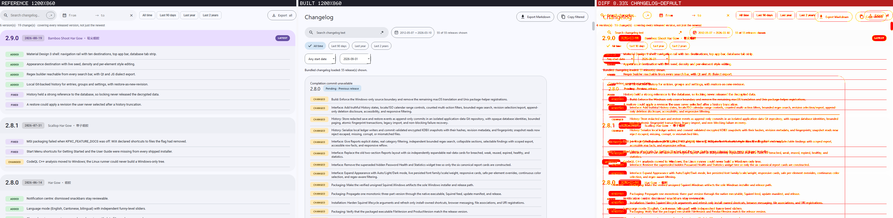

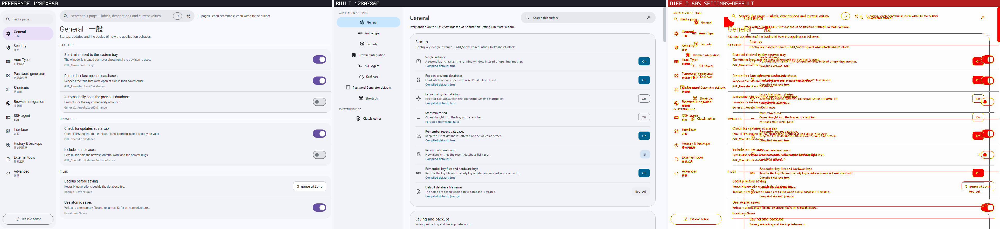

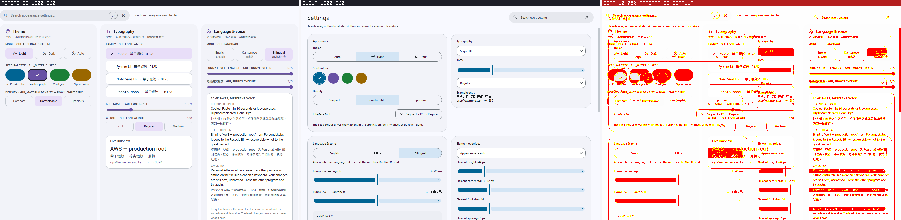

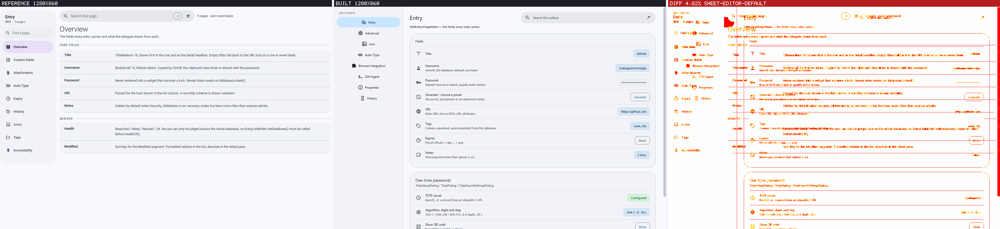

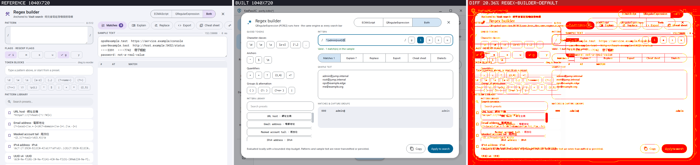

</details>

Not captured yet: dark theme, the compact and minimum widths, 125 to 200 percent display scales, dialogs and error states. The clipping matrix under `design/parity/evidence/clipping/` holds captures at the compact and expanded widths that are not yet promoted into this list.

## Lines of code

Counted by the committed `node scripts/count-lines.mjs`; the same table is published in every release
and the release body is the record. The figures below are the local measurement at `e09d6e28`; release
[v2.8.9301](https://github.com/Ding-Ding-Projects/keepassxc/releases/tag/v2.8.9301) measured
`d7e8adba` at 340,795 project lines because it counted the clipping-matrix probe dumps as generated
project lines, a classification corrected in the counter after that release.

| Area | Lines |
| --- | ---: |
| Application source (`src`, excluding the Material layer) | 120,815 |
| Material UI (`src/gui/material`) | 34,025 |
| Design references and parity tooling | 33,883 |
| Tests | 30,868 |
| Everything else in the project total | 14,490 |
| **Project total** | **234,081** |

Vendored fonts and runtime, bundled third-party sources, upstream documentation sources and
translation files are counted separately and held out of the project total (509,232 lines). Of the
project total, 23,615 lines across 20 files are generated by tooling. Attribution by surviving
`git blame` line: agents 91,434 (39.1 %), people 142,647 (60.9 %).

**How long a person would have taken (estimate, not a measurement):** the 210,466 hand-written
project lines at a sustained 60 to 100 finished lines per working day of C++, Qt and tooling code
give roughly 2,100 to 3,500 working days, or about 9 to 15 person-years. Vendored, generated and
translation lines are excluded, exactly as in the count above, and the range is deliberately wide
because a line of cryptography or installer lifecycle code is not a line of documentation.

## Contributing

Bug reports and ideas for the *upstream* password manager belong in the
[KeePassXC issue tracker](https://github.com/keepassxreboot/keepassxc/issues). Issues specific to
this fork's interface belong here.

Contributors adhere to the project's [Code of Conduct](CODE-OF-CONDUCT.md). See
[CONTRIBUTING](.github/CONTRIBUTING.md) for the upstream workflow.

## Generative AI

Substantial parts of this fork's Material interface were written with agent-assisted development.
All submissions go through review regardless of workflow.

## License

KeePassXC code is licensed under GPL-2 or GPL-3. The Material interface layer added by this fork
carries the same licence. Third-party file licensing is detailed in [COPYING](./COPYING).
