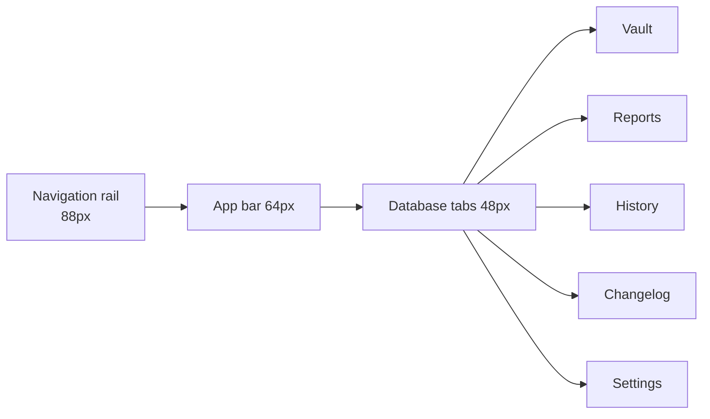

# KeePassXC — Material

A fork of [KeePassXC](https://keepassxc.org) whose interface is rebuilt from the ground up in **Material Design 3**.

The cryptography, KDBX format handling, browser and SSH integrations, and `keepassxc-cli` are upstream code and deliberately untouched. What changed is the presentation layer: the stock Qt styling, the toolbar-and-tabs shell, and the scattered per-widget stylesheets are gone, replaced by one token-driven design system.

> For the official, supported password manager, use [keepassxreboot/keepassxc](https://github.com/keepassxreboot/keepassxc).

## Pages

| Page | Contents |
| --- | --- |
| [Material Design](./Material-Design.md) | Colour roles, seeds, density, shape, motion, and the component library |
| [Building](./Building.md) | Toolchain, dependencies, configure and build commands |
| [Passkeys](./Passkeys.md) | How passkey registration and saving work, and how they are tested |

## Interface at a glance

| Destination | Contents |
| --- | --- |
| **Vault** | Group sidebar with tag chips, pill search bar, entry list, and a 392 px detail pane with credentials, a strength meter, and a live TOTP countdown ring |
| **Reports** | Password health, breach and reuse findings, database statistics |
| **History** | Local, Git-backed revision history with diff and restore |
| **Changelog** | Every released version, searchable and date-filterable, Markdown export |
| **Settings** | Appearance, language, behaviour, integrations, plus spec sheets for every application setting |

## Appearance is a runtime setting

Everything the interface draws resolves through one design system, so the whole application restyles live — no restart:

- **Theme** — light or dark, or follow the OS
- **Seed colour** — KeePassXC blue, baseline purple, vault green, signal amber
- **Density** — compact / comfortable / spacious (40 / 52 / 64 px rows)
- **Interface font** — family, size scale, weight, with CJK-safe fallback

No widget hard-codes a colour; each asks the theme for a semantic role.

## Cross-cutting behaviour

- **Regex builder** reachable from every search bar. Plain-text search stays the default; regex is an explicit opt-in with two-way sync of query, pattern, flags, and mode.
- **Non-blocking notifications** — snackbars for anything that only informs; modals reserved for decisions the user must make. Dismissed notifications stay reviewable in the notification centre.
- **Language modes** — English, playful Hong Kong Cantonese, or bilingual, with an independent 1–5 humour slider per language. Humour styles the voice; the facts stay exact.
- **External editor** — detect installed editors and open the database folder or a file in one.

## Status

The interface rewrite is tracked in [issue #1](https://github.com/Ding-Ding-Projects/keepassxc/issues/1) with a rolling progress thread in [discussion #2](https://github.com/Ding-Ding-Projects/keepassxc/discussions/2).
