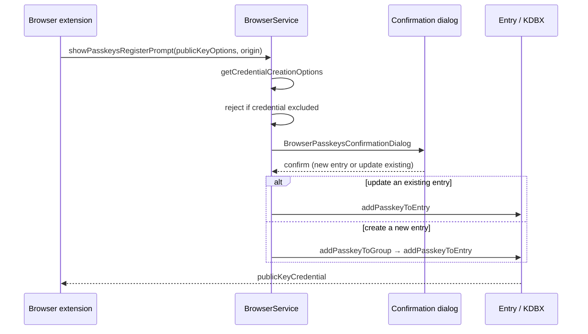

# Passkeys

Passkey support is upstream KeePassXC functionality reached through browser integration. This page documents the **save** path, because that is the part that must not break.

## Registration flow



The default group for new passkey entries is **KeePassXC-Browser Passkeys**.

## What gets stored

`BrowserService::addPasskeyToEntry()` writes these entry attributes:

| Attribute | Protected | Contents |
| --- | --- | --- |
| `KPEX_PASSKEY_USERNAME` | no | Relying-party username |
| `KPEX_PASSKEY_RELYING_PARTY` | no | RP id, e.g. `example.com` |
| `KPEX_PASSKEY_CREDENTIAL_ID` | **yes** | Credential identifier |
| `KPEX_PASSKEY_PRIVATE_KEY_PEM` | **yes** | The private key |
| `KPEX_PASSKEY_USER_HANDLE` | **yes** | User handle |
| `KPEX_PASSKEY_FLAG_BE` | no | Backup eligible |
| `KPEX_PASSKEY_FLAG_BS` | no | Backup state |

The entry also gains a `Passkey` tag and the browser passkey icon.

> [!IMPORTANT]
> The credential id, private key, and user handle **must** be written protected. An unprotected private key sits in the KDBX in plaintext, which defeats the point of storing it there.

## Overwrite protection

If the target entry already has a passkey, the save is gated behind a confirmation prompt and aborts unless the user picks **Overwrite**. A new entry never hits this path.

## Test coverage

`tests/TestPasskeys.cpp` — **25 passed, 0 failed**.

Beyond the WebAuthn primitives (attestation objects, EC and RSA key loading, flags, RP id validation), three tests cover saving specifically:

| Test | Asserts |
| --- | --- |
| `testEntry` | `hasPasskey()` after registration |
| `testPasskeyAttributesAreStoredAndProtected` | Every attribute value, and that the three secrets are protected |
| `testPasskeySurvivesDatabaseRoundTrip` | A registered passkey written through `KeePass2Writer` and read back with `KeePass2Reader` keeps its values **and** its protection flags |

The round-trip test is the one that matters: registration is only useful if the credential is still there after the database is closed and reopened.

```bash
cmake --build build --target testpasskeys
./build/tests/testpasskeys -o results.txt,txt
```

## Import and export

`PasskeyImporter` / `PasskeyExporter` handle `.passkey` files, with `PasskeyImportDialog` letting the user pick the target entry and group. The importer is also reused during registration when the user chooses to attach a passkey to an existing entry.

## Interface rewrite

The Material rewrite touches how these dialogs *look*, never what they store. `addPasskeyToEntry` and `addPasskeyToGroup` are untouched, and the tests above are the guard rail: if a restyle breaks the save path, `testPasskeySurvivesDatabaseRoundTrip` fails.
